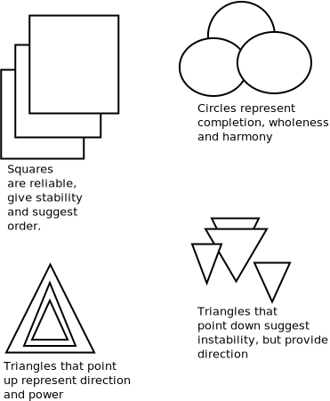

Greetings [From Informatics](https://www.informatics.illinois.edu/) and welcome to Aditya's page.

## Use Shapes to Make Your Designs Stand Out

 Conscious use of shapes can help send the right message about your brand and keep your visual marketing strategy consistent. Learn how different shapes convey hidden meanings and feelings so that you can choose the best shape combinations for your designs. 

## Basic types of space

* Geometric: These are the most commonly used shapes. We are introduced to them as kids in school.

* Organic: These shapes represent things from the natural world.

* Abstract flows: These are representations of everyday objects and people. They can also be simplified renditions of actions and processes.

## Geometric shape examples

 Shapes represent ideas and feelings 

## Source

[Geometric meanings](https://visme.co/blog/geometric-meanings/)