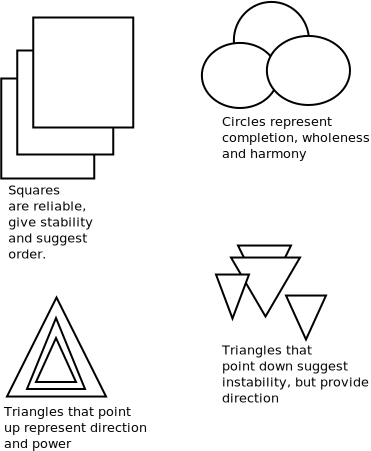

Greetings [From Informatics](https://www.informatics.illinois.edu/) and welcome to Aditya's page.

## Who is Gonzalo Higuain?

Chelsea' first choice centre forward

## Basic components of an activity diagram

* Action: A step in the activity wherein the users or software perform a given task. In Lucidchart, actions are symbolized with round-edged rectangles.

* Decision node: A conditional branch in the flow that is represented by a diamond. It includes a single input and two or more outputs.

* Control flows: Another name for the connectors that show the flow between steps in the diagram.

* Start node: Symbolizes the beginning of the activity. The start node is represented by a black circle.

* End node: Represents the final step in the activity. The end node is represented by an outlined black circle.

## Activity diagram examples

Activity diagrams map out process flows in a way that's easy to understand. Consider the example below when it comes to creating UML activity diagrams.

## Source

[UML Activity Diagram Tutorial](https://www.lucidchart.com/pages/uml-activity-diagram?a=0)