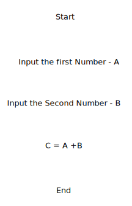

# Flowcharts
A Flowchart is a graphical representation of a process. It has boxes of different shapes with each box representing a step in the process. The boxes are connected by a line with direction showing the flow of the process. It is generally used to represent the steps of a computer algorithm graphically and makes it easier to understand any process. The commonly used shapes in a flowchart are

1. Oval

    This shape is used to mark the beginning or end of a Program

2. Rectangle

    This shape is used to show individual steps or actions in the process.

3. ParallelogramInput-Output Symbol

    This is also called the InputOutput Symbol and represents the data to input into the program or the data coming out 
    from the program.

4. Arrow Lines

    These are used to represent the flow of the process. It connects the boxes of the flowchart with an arrow showing the 
    direction of the 

5. DiamondDecision Symbol
    The symbol is used when the program has to make a decision based on the input to it. It gives different output based 
    on the input to the program

#### Below is an example of a flowchart for adding two numbers A and B

