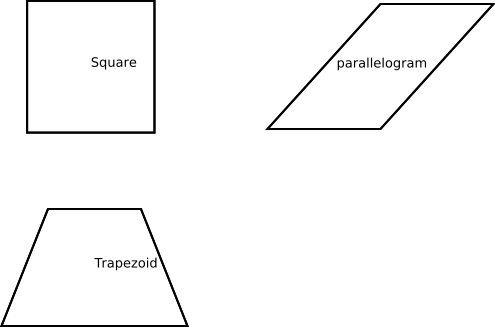

# Quadrilateral

## Defination
In Euclidean plane geometry, a quadrilateral is a polygon with four edges (or sides) and four vertices or corners. Sometimes, the term quadrangle is used, by analogy with triangle, and sometimes tetragon for consistency with pentagon (5-sided), hexagon (6-sided) and so on.
## Type
In a convex quadrilateral, all interior angles are less than 180° and the two diagonals both lie inside the quadrilateral.

### Irregular quadrilateral (British English) or trapezium (North American English):
no sides are parallel. (In British English this was once called a trapezoid.)
### Trapezium (UK) or trapezoid (US)
At least one pair of opposite sides are parallel.
### Isosceles trapezium (UK) or isosceles trapezoid (US) 
One pair of opposite sides are parallel and the base angles are equal in measure. 
### Parallelogram 
A quadrilateral with two pairs of parallel sides. 
### Rhombus or rhomb 
All four sides are of equal length. An equivalent condition is that the diagonals perpendicularly bisect each other.
### Rhomboid
A parallelogram in which adjacent sides are of unequal lengths and some angles are oblique (equivalently, having no right angles). 
### Rectangle 
All four angles are right angles. 
### Square (regular quadrilateral)
All four sides are of equal length (equilateral), and all four angles are right angles. 
### Oblong
A term sometimes used to denote a rectangle which has unequal adjacent sides (i.e. a rectangle that is not a square).
### Kite 
Two pairs of adjacent sides are of equal length. 
## Graphics

## Source
The content in this page is from [Wikipedia Page](https://en.wikipedia.org/wiki/Quadrilateral).