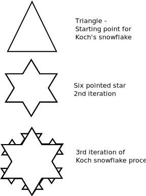

# Koch snowflake

Koch Snowflake is a special [Fractal](https://en.wikipedia.org/wiki/Fractal).

[Niels Fabian Helge von Koch](https://en.wikipedia.org/wiki/Helge_von_Koch), a swedish noble gave his name to one of the early fractal curves to be described - [Koch snowflake](https://en.wikipedia.org/wiki/Koch_snowflake)
It is based on a paper titled "On a continuous curve without tangents, constructible from elementary geometry".

> Koch snowflake can be constructed as shown in the diagram below - Only 3 steps are shown
* Start with an equilateral triangle
* Divide each side into 3 parts
* construct equilateral trangles in the middle parts
* Repeat this step reccursively

This can result in a curve that looks continous in a zoomed out view but can be broken into discrete fractals when zoomed in

### Dimensions
> The number of sides after k iterations is:
 $$ Num_sides = 3*4^k $$
 $$ length_of_each_sides = 3/original_side_length^k $$

> Animation illustration [https://en.wikipedia.org/wiki/Koch_snowflake#/media/File:Kochsim.gif]

