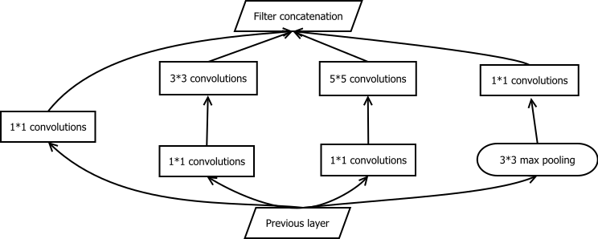

# Yixin Zhang's Page

Hello, welcome to Yixin Zhang's page! I'd like to present a part of ***Inception*** here. 

## Inception
***Inception*** is a deep [convolutional neural network](https://en.wikipedia.org/wiki/Convolutional_neural_network) architecture proposed in the paper [Going deeper with convolutions](https://arxiv.org/abs/1409.4842) by Google in 2014. It's for the classification and detection  task of [ImageNet Large-Scale Visual Recognition Challenge 2014 (ILSVRC14)](http://www.image-net.org/challenges/LSVRC/2014/).

## GoogLeNet
The particular incarnation of ***Inception*** used in the [ILSVRC14](http://www.image-net.org/challenges/LSVRC/2014/) is ***GoogLeNet***, the name of which is an homage to Yann LeCun's pioneering [LeNet 5 network](http://yann.lecun.com/exdb/publis/pdf/lecun-89e.pdf).

## Inception Module
Inception module is a key part of ***Inception*** architecture. According to [Udacity's Deep Learning Course](https://www.udacity.com/course/deep-learning--ud730), the main idea of inception module is that, for each layer, people don't need to decide what type of convolution to use. Instead, both 3 * 3 and 5 * 5 convolutions are done in parallel and concatenated before going to the next layer, i.e., the model will "learn" to pick the best itself.

The inception module is depicted as below:

