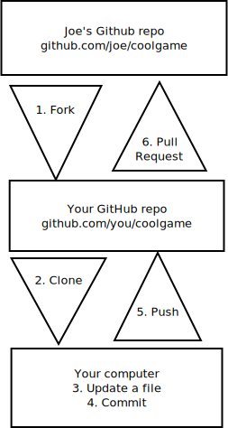

## Github - Forking and updating a repo

Let's say there's a programmer named Joe who built a game you would like to improve, and he is hosting his code in a GitHub repository. Here's what you do:

1.    *Fork his repo*: This is a GitHub operation, in which you are making a copy of Joe's repository (including the files, commit history, issues, and more). This repository now lives in your GitHub account. Nothing has yet happened to your local computer.

2.    *Clone your repo*: This is a Git operation, in which you are using Git to tell GitHub "please send me a copy of my repo." The repo is now stored on your local computer.

3.    *Update some files*: You can now make updates to the files in whatever program or environment you like.

4.    *Commit your changes*: This is a Git operation, in which you are telling Git to record the file changes you have made. This is an operation on your local computer only.

5.    *Push your changes to your GitHub repo*: This is a Git operation, in which you are using Git to tell GitHub "here are my changes." Pushing does not happen automatically, so until you do this step, GitHub does not know about your commits.

6.    *Send a pull request to Joe*: If you think that Joe might like to incorporate your changes, you send him a pull request. This is a GitHub operation, in which you are communicating your changes to Joe, and "requesting" that he "pull" from your repo. It is up to him whether he pulls from you or not.

    If Joe accepts your pull request, he will pull your changes into his repo. Victory!

Source: https://www.dataschool.io/simple-guide-to-forks-in-github-and-git/ 