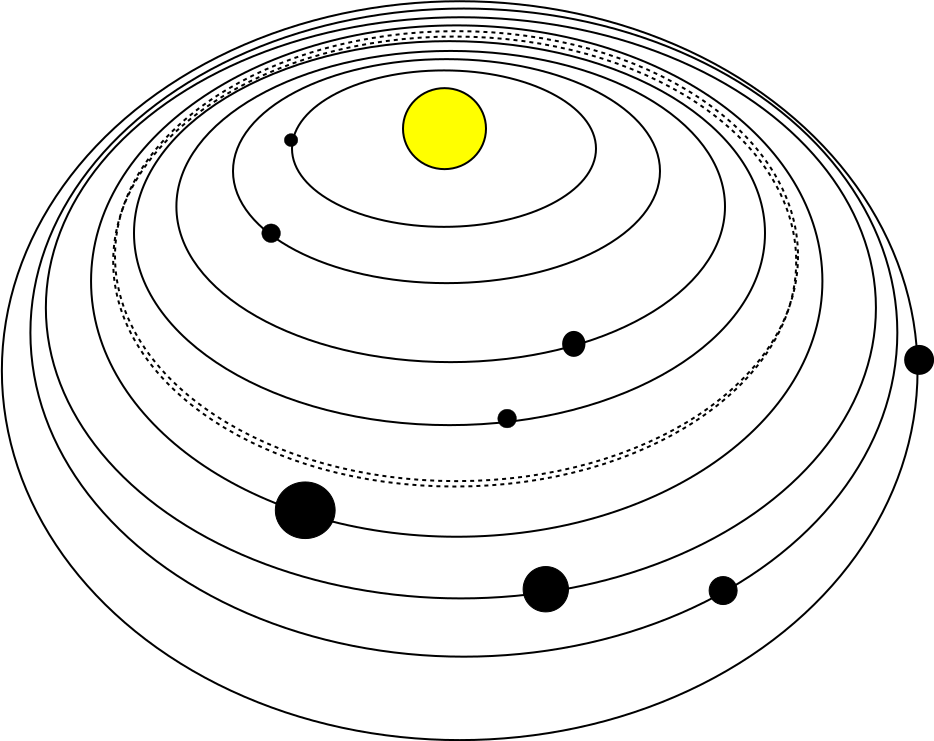

Welcome to my Sandbox page!

This is Pranali Mane and I have used markdown to make a page which gives basic information about the solar system.

## Solar System
Our solar system consists of an average star we call the _Sun_, the planets 
* _Mercury_
* _Venus_
* _Earth_
* _Mars_
* _Jupiter_
* _Saturn_
* _Uranus_
* _Neptune_

It also includes: _the satellites of the planets_; numerous _comets_, _asteroids_, and _meteoroids_; and the interplanetary medium.

The following image shows how the solar system looks like:

### The Markdown format:

## Source
[Solar System - Introduction](http://solarviews.com/eng/solarsys.htm)