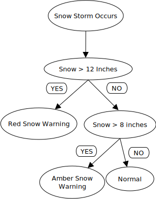

## SNOW STORMS
**Snow** refers to forms of ice crystals that precipitate from the atmosphere (usually from clouds) and undergo changes on the Earth's surface. Snowstorms organize and develop by feeding on sources of atmospheric moisture and cold air.

A **winter storm** is an event in which varieties of precipitation are formed that only occur at low temperatures, such as snow or sleet,or a rainstorm where ground temperatures are low enough to allow ice to form (i.e. freezing rain). In temperate continental climates, these storms are not necessarily restricted to the winter season, but may occur in the late autumn and early spring as well. Very rarely, they may form in summer, though it would have to be an abnormally cold summer, such as the summer of 1816 in the Northeastern United States.

**Snowstorms** are storms where large amounts of snow fall. Two inches (5 cm) of snow is enough to create serious disruptions to traffic and school transport (because of the difficulty to drive and maneuver the school buses on slick roads).Snowfalls in excess of 6 inches (15 cm) are usually universally disruptive.

#**Snow Storm Details** 

## Flow Chart

# Check the [weather](https://weather.com/) to know if you are expecting a snow storm!!
