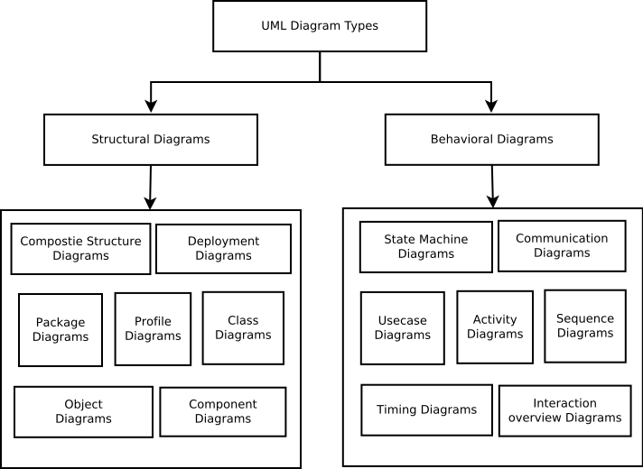

# Unified Modeling Language
UML (Unified Modeling Language) is a standardized modeling language consisting of an integrated set of diagrams, developed to help system and software developers for specifying, visualizing, constructing, and documenting the artifacts of software systems, as well as for business modeling and other non-software systems. There are two main categories: structure diagrams and behavioral diagrams. 
## Structure Diagrams
Structure diagrams show the things in the modeled system. In a more technical term, they show different objects in a system.
###  Structure Diagrams include:
* Class Diagram
* Object Diagram
* Component Diagram
* Composite Structure Diagram
* Deployment Diagram
* Package Diagram
* Profile Diagram
## Behavioral Diagrams
Behavioral diagrams show what should happen in a system. They describe how the objects interact with each other to create a functioning system.
### Behavioral Diagrams include:
* Activity Diagram
* Use Case Diagram
* Interaction Overview Diagram
* Timing Diagram
* State Machine Diagram
* Communication Diagram
* Sequence Diagram
## Summary

## Reference
[UML Diagram Types Guide](https://creately.com/blog/diagrams/uml-diagram-types-examples/)

