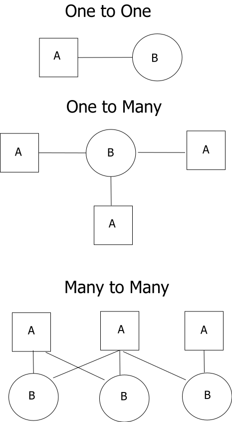

# Entity-Relationship Model (ER Model)

An entity-relationship model (ERM) is a theoretical and conceptual way of showing data relationships in software development. ERM is a database modeling technique that generates an abstract diagram or visual representation of a system’s data that can be helpful in designing a relational database. These diagrams are known as entity-relationship diagrams, ER diagrams or ERDs.

Relationships Between Entities
A relationship is how the data is shared between entities. There are three types of relationships between entities:

1. One-to-One
One instance of an entity (A) is associated with one other instance of another entity (B). For example, in a database of employees, each employee name (A) is associated with only one social security number (B).

2. One-to-Many
One instance of an entity (A) is associated with zero, one or many instances of another entity (B), but for one instance of entity B there is only one instance of entity A. For example, for a company with all employees working in one building, the building name (A) is associated with many different employees (B), but those employees all share the same singular association with entity A.

3. Many-to-Many
One instance of an entity (A) is associated with one, zero or many instances of another entity (B), and one instance of entity B is associated with one, zero or many instances of entity A. For example, for a company in which all of its employees work on multiple projects, each instance of an employee (A) is associated with many instances of a project (B), and at the same time, each instance of a project (B) has multiple employees (A) associated with it.

