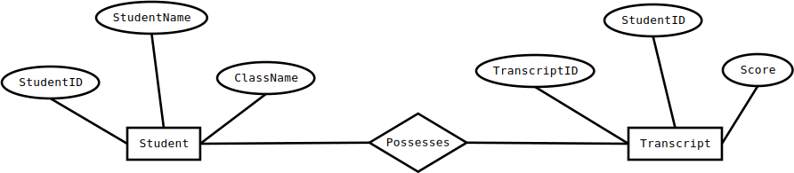

# Entity Relationship Diagram

An ER diagram is a means of visualizing how the information a system produces is related. There are four main components of an ERD:
* Entities, which are represented by rectangles
* Actions, which are represented by diamond shapes
* Attributes, which are represented by ovals
* Connecting lines, solid lines that connect attributes to show the relationships of entities in the diagram

## For Example: 

