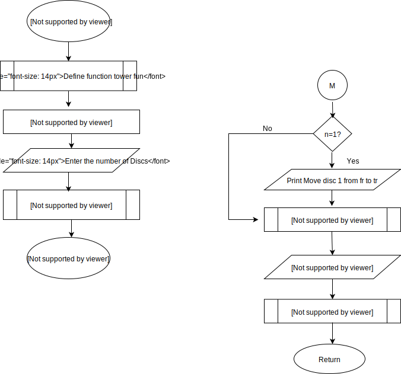

# Tower of Hanoi Algorithm and Flowchart
Tower of Hanoi is a mathematical puzzle with three rods and ‘n’ numbers of discs; the puzzle was invented by the French mathematician Edouard Lucas in 1883. The objective of this puzzle is to transfer the entire stack to another rod. In this post, I have presented algorithm and flowchart for Tower of Hanoi along with a brief introduction to Tower of Hanoi and some of its important properties.

The basic trick behind the solution of Tower of Hanoi puzzle is to break the problem down into a number of smaller problems and further break these into even smaller ones, so that it is made a typical best suited problem for the application of recursive function. Before taking you through the algorithm and flowchart, given below are certain rules which have been utilized in Tower of Hanoi algorithm and flowchart presented in this post.

## Rules of Tower of Hanoi:
- Only a single disc is allowed to be transferred at a time.
- Each transfer or move should consists of taking the upper disk from one of the stack and then placing it on the top of another stack i.e. only a top most disk on the stack can be moved.
- Larger disk cannot be placed over smaller disk; placing of disks should be in increasing order.

## Tower of Hanoi Algorithm:
- Start
- Define function
- Declare variable n
- Enter the number of disc
- Call the function
- Stop

## Algorithm for Function Definition

- if n=1, print Move disc 1 from fr to tr
- Call the function with n-1, fr, ar, tr
- Move disc n from fr to tr
- Call function with n-1, ar, tr, fr
- Return

## Tower of Hanoi Flowchart:

Also see, 

[Tower of Hanoi C Program](https://www.codewithc.com/c-program-for-tower-of-hanoi-recursion/)

In programming any high level language, algorithm and flowchart are the first steps to be considered by a programmer after recognizing the problem, and these serve as a key for programming. I hope the algorithm and flowchart given here will help you to write the source code for solving Tower of Hanoi puzzle in any programming language. If you have any questions regarding the algorithm or flowchart, discuss them in the comments section below.

## Source
[Tower of Hanoi Algorithm and Flowchart](https://www.codewithc.com/tower-of-hanoi-algorithm-flowchart/)
